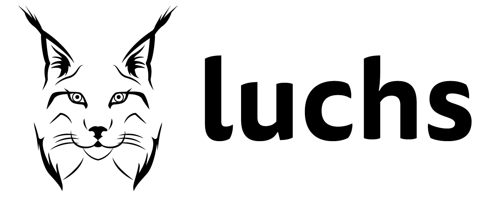

# luchs - a CMake support framework

> **luchs** - _lazy and uniform CMake helper scripts_ ... or German for "lynx".

An open-source CMake support framework whose newest versions can be found
[here](https://github.com/DenizThatMenace/luchs).

## Purpose

This is a collection of CMake scripts that together make up a convenient CMake support framework
which should simplify and generalize using CMake.

It should be used by larger CMake based projects to conveniently and uniformly build them.

## Manual

* [Getting started](docs/01_getting_started.md)
* [Installing build-artifacts](docs/02_installing.md)
* [Packaging build-artifacts](docs/03_packaging.md)
* [Environment variables](docs/04_env-variables.md)
* [Configuration options](docs/05_options.md)
* [Customizing _luchs_](docs/06_customization.md)

## Origin

The foundation of the _luchs_ CMake support framework was originally developed by
[Deniz Bahadir](mailto:deniz@code.bahadir.email) at his former employer
[BENOCS](https://www.benocs.com) and open-sourced under the
[Boost Software License](https://www.boost.org/LICENSE_1_0.txt).

This original code can be found at [Github](https://github.com/DenizThatMenace/luchs/tree/v0.1.0-benocs).

Further development took place during Deniz' time at his new employer
[exocad](https://www.exocad.com), who kindly agreed to also make those
advancements available as open-source.
